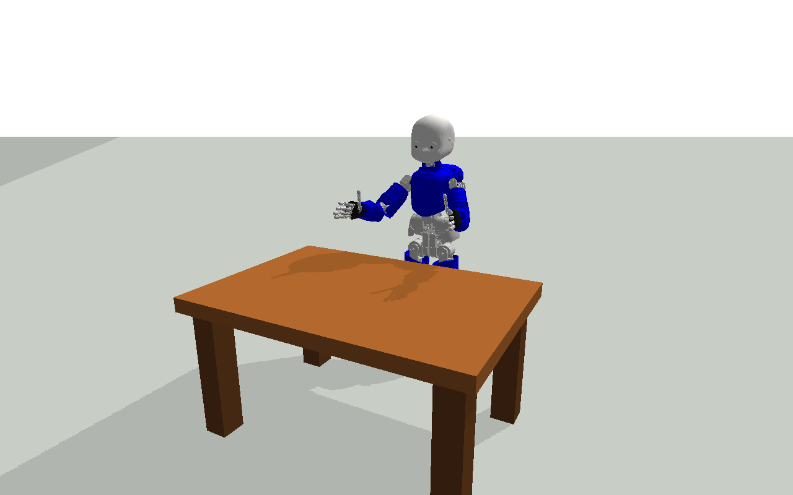
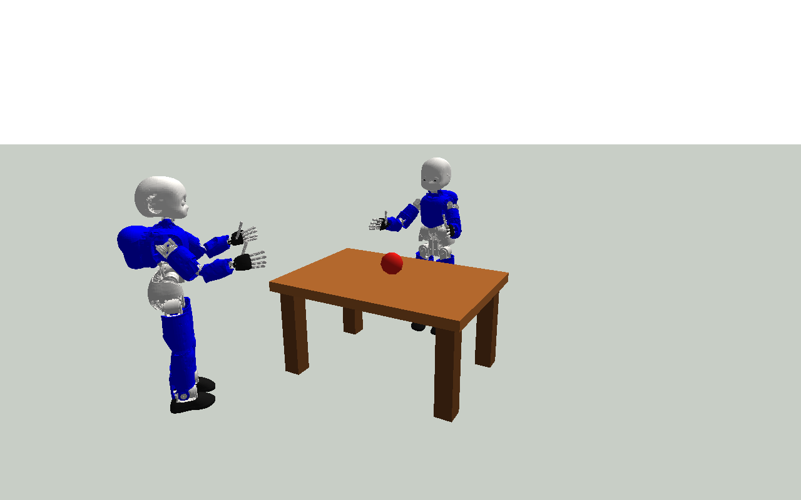
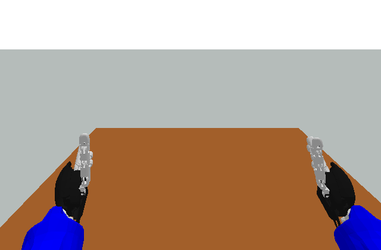
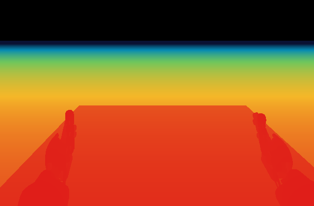
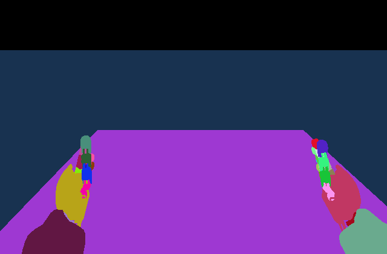
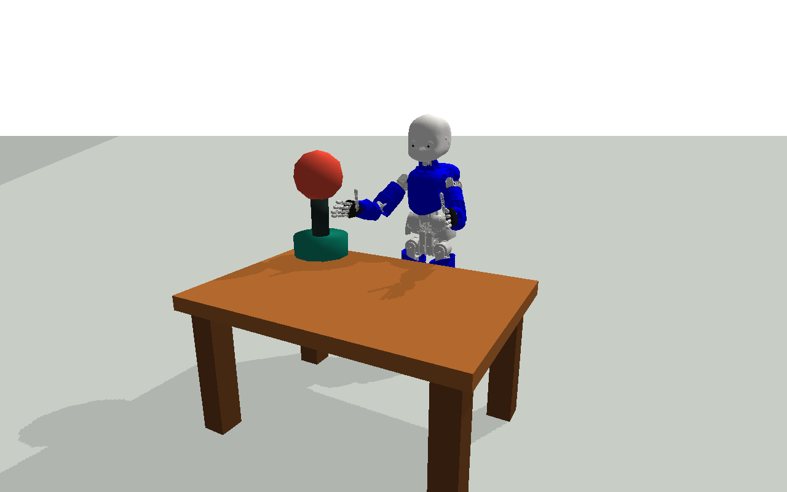

# PyCubSim2

PyCubSim2 is an extensible PyBullet simulator that starts with one PyCub and
one table. Robots, objects, sensors, behaviors, cameras, and external agents
can all be configured from one integrated GUI.

The initial iCub model and 3D assets come from
[rustlluk/pyCub](https://github.com/rustlluk/pyCub). PyCubSim2 preserves credit
to that reference project while adding a separate scene editor, multi-robot
controls, RGB-D views, webcam input, dual-view rendering, and a plugin-style
agent interface. It is not a drop-in copy of the original pyCub high-level
Python API.



## Quick Start

On macOS, open `PyCubSim2.app` in Finder or run:

```bash
cd /path/to/PyCubSim2
./launch.command
```

To create the dedicated environment:

```bash
cd /path/to/PyCubSim2
conda env create -f environment.yml
conda activate pycubsim2
python run_sim.py
```

`launch.command` and the app bundle prefer the `pycubsim2` environment. On the
original development machine, they can also use the existing
`pycub-homeostatic` environment as a fallback.

## Scene Editing

The `Scene` tab supports:

- `+ PyCub`: add another independently controllable PyCub.
- `+ Table`: add a table.
- `+ Object`: add a box, sphere, or cylinder with configurable dimensions,
  mass, color, and fixed/dynamic state.
- `Import model`: load URDF, SDF, MJCF (`.xml`), OBJ, or STL files.
- `Import agent`: load an `agent.json` bundle containing a model, cameras, and
  a Python controller.
- `Duplicate` / `Remove`: duplicate or remove the selected entity.
- `Apply`: update name, position, orientation, scale, mass, dimensions, and
  color.

`Open` and `Save` read or write the complete scene as JSON. `Reset` restores
the default one-PyCub and one-table scene.

`Undo` and `Redo` cover entity addition, removal, property edits, and placement
changes made from either the map or the 3D view. On macOS, use
`Command + Z` / `Command + Shift + Z`.

Properties that do not apply to the selected entity are disabled. For example,
URDF mass and materials continue to use definitions from the imported file.



## Layout Map

The `Layout` tab provides a placement map for every entity in the scene,
including PyCubs, tables, primitives, imported models, and agent bundles.

- Click an entity to select it and synchronize the Scene, Actions, and Sensors
  tabs.
- Drag an entity to move it on the X-Y plane.
- Drag the heading handle to change yaw.
- Use the mouse wheel or trackpad scroll to rotate the selected entity in
  five-degree increments.
- Enter X, Y, and Yaw values and press `Apply placement` for numeric editing.
- Press `Fit world camera` to frame the complete scene around its spatial
  center.

Placement is updated in the 3D view while dragging. One completed drag is
stored as one undoable operation.

## Actions

Each PyCub can independently use:

- Manual pose
- Idle breathing
- Look around
- Right arm wave
- Left arm wave
- Both arms wave
- Whole-body tilt
- Random motion
- Keyframe action

`Start` and `Stop` affect only the selected PyCub. Manual joint sliders, left
and right grips, and world-coordinate arm IK (`Reach`) are also per robot.
Manual or IK commands apply immediately; only time-varying behaviors require
continuous updates.

`Load action JSON` loads keyframe actions from `actions/`. Joint values are in
degrees, and grip values range from `0.0` open to `1.0` closed.

## Cameras and Sensors

Available camera sources include:

- World camera
- Mac webcam 0
- Left eye, right eye, and body camera for every PyCub
- Cameras defined by imported agent bundles
- A body camera for general imported 3D models

Adding a PyCub immediately adds all three of its simulated cameras to the
camera selectors. Sources are not limited to the first robot. Select the
primary source from the control above the 3D view or from the `Sensors` tab.
Select the secondary source from the `Second view` row when dual view is
enabled.

Available image modes are `Sensor RGB`, `Sensor Depth`, and `Segmentation`.
Structured sensors include joint state, IMU, contact, and 24 range rays. Each
feature can be enabled or disabled for the relevant entity.

`Export sensor snapshot` saves the displayed image and a JSON snapshot.

The first webcam use may trigger a macOS camera permission prompt. A physical
webcam supplies RGB only. Depth and segmentation are generated by simulated
cameras.

The internal `depth_m` array is the metric camera-axis Z distance obtained by
unprojecting PyBullet's OpenGL depth buffer with the configured near and far
planes. The depth display uses a stable logarithmic color scale from 0.05 m to
5 m. The center-pixel distance appears in the image overlay, and missing
returns are black.

| Left eye RGB | Left eye depth | Left eye segmentation |
| --- | --- | --- |
|  |  |  |

## Camera Controls and Dual View

- `Camera` cursor + left drag: orbit.
- `Camera` cursor + Shift-left drag: pan.
- Middle drag or right drag: pan in any cursor mode.
- Mouse wheel or trackpad scroll: zoom.
- Double-click: focus the selected entity.
- `Select` cursor + click: select a PyCub, table, object, model, or agent in the
  3D scene.
- `Move` cursor + drag: move the selected entity on the X-Y plane in World or
  Top view.
- Camera tab: yaw, pitch, distance, shadows, and render quality.
- `Control + Tab` / `Shift + Control + Tab`: cycle sidebar tabs.

The selected entity is outlined in yellow. `Info`, `Actions`, and `Sensors`
open the corresponding controls for that entity.

World camera reset and `Fit whole scene` use the complete scene bounds, not
the first PyCub. Top and Side views also use the scene center.

`Dual view` splits the viewer into two independent panes. For example, the
left pane can show World while the right pane shows another PyCub's right eye,
Depth, Segmentation, or a Mac webcam. Toggle it with the GUI or
`Command + D` on macOS and `Control + D` on Windows/Linux.

Performance mode renders at up to 1.25 times the display resolution, Balanced
at 1.65 times, and Quality at 2 times before downsampling. This avoids the old
640-pixel upscale while retaining explicit performance choices.

## External 3D Agents

Use `Import model` for a model without behavior. Use `Import agent` when a
model, cameras, and behavior should be added together.

Example:

```text
examples/agents/beacon_agent/
  agent.json
  beacon.urdf
  controller.py
```

After importing the sample, select the agent and press `Start` in the Actions
tab. Its controller performs vertical movement, turning, and neck motion.

See [docs/AGENT_BUNDLES.md](docs/AGENT_BUNDLES.md) for the manifest format and
controller API. Local controllers execute as normal Python code, so only load
trusted bundles.



## Performance

The default is `Performance` quality with shadows disabled.

- Static scenes are rendered only when the view changes.
- Fixed PyCubs and tables update only changed joints.
- Adding a dynamic object or model automatically enables 240 Hz PyBullet
  physics.
- Active behaviors advance using wall-clock-aware stepping.
- Balanced, Quality, and shadows trade additional CPU time for image quality.

For contact experiments, disable `Fixed base` on an object and use a mass
greater than zero.

## Headless Mode

```bash
python run_sim.py --headless --steps 480 \
  --output artifacts/headless_preview.png

python run_sim.py --headless --steps 480 \
  --agent examples/agents/beacon_agent/agent.json \
  --output artifacts/agent_preview.png
```

List all options:

```bash
python run_sim.py --help
```

## Tests

```bash
python -m unittest discover -s tests -v
```

The suite covers the default scene, multiple PyCubs, camera enumeration,
behaviors, IK, dynamic physics, RGB-D, metric depth, segmentation, structured
sensors, scene save/load, external controllers, placement-map editing,
Undo/Redo, dual view, and integrated GUI construction.

## Project Structure

```text
pycubsim2/
  actions.py       Built-in and JSON keyframe actions
  config.py        Scene, entity, and sensor configuration
  gui.py           Integrated GUI
  layout_editor.py Placement-map editor for arbitrary entities
  plugins.py       Agent bundles and controller host
  sensors.py       RGB-D, segmentation, and webcam support
  simulation.py    PyBullet scene, physics, cameras, picking, and IK
assets/iCub/       iCub URDF, meshes, and skin data from rustlluk/pyCub
actions/           Example keyframe actions
examples/agents/   Example external agents
layouts/           Saved scenes
```

## Contributors and References

PyCubSim2:

- [yuta4869](https://github.com/yuta4869): project owner, integration, and
  PyCubSim2 implementation.

Reference project [rustlluk/pyCub](https://github.com/rustlluk/pyCub):

- [Lukáš Rustler](https://github.com/rustlluk): creator and primary author of
  pyCub.
- Matěj Hoffmann: co-author of the pyCub framework publication cited by the
  original project.
- [Ilia Zavidnyi](https://github.com/zavidnyi): contributor recorded in the
  original pyCub Git history.

PyCubSim2 is a derivative simulator and does not claim authorship of the
original pyCub model assets or simulator work.

## Source and License

The iCub model assets are based on
[rustlluk/pyCub](https://github.com/rustlluk/pyCub) commit
`081ef65565355ca700604e40b94f8491c8e4d15a`, under CC BY 4.0.

See [THIRD_PARTY_NOTICES.md](THIRD_PARTY_NOTICES.md) and
[LICENSE](LICENSE) for attribution and license details.

The original pyCub project requests the following citation:

```bibtex
@inproceedings{rustler2026pycub,
  title={Learning with pyCub: A Simulation and Exercise Framework for Humanoid Robotics},
  author={Lukas Rustler and Matej Hoffmann},
  year={2026},
  booktitle={17th International Conference on Robotics in Education (RiE 2026)},
  organization={Springer}
}
```

---

PyCubSim2は、1台のPyCubと1台の机から始め、ロボット、物体、センサー、
行動、カメラ、外部エージェントを1つの統合GUIから構成できる拡張PyBullet
シミュレーターです。

初期iCubモデルと3D資産には
[rustlluk/pyCub](https://github.com/rustlluk/pyCub)を使用しています。
PyCubSim2は参考元へのクレジットを明記しつつ、独立したシーン編集、複数ロボット制御、
RGB-D表示、Webcam入力、2画面表示、外部エージェント機構を追加しています。
元のpyCubの高水準Python APIをそのまま複製したものではありません。


## 起動

macOSではFinderから`PyCubSim2.app`を開くか、次を実行します。

```bash
cd /path/to/PyCubSim2
./launch.command
```

専用環境を作る場合:

```bash
cd /path/to/PyCubSim2
conda env create -f environment.yml
conda activate pycubsim2
python run_sim.py
```

`launch.command`とアプリは`pycubsim2`環境を優先します。開発元のマシンでは、
既存の`pycub-homeostatic`環境もフォールバックとして利用できます。

## シーン編集

`Scene`タブでは次の操作ができます。

- `+ PyCub`: 独立して制御できるPyCubを追加
- `+ Table`: 机を追加
- `+ Object`: box、sphere、cylinderを寸法、質量、色、固定／動的の設定付きで追加
- `Import model`: URDF、SDF、MJCF（`.xml`）、OBJ、STLを読込
- `Import agent`: モデル、カメラ、Python Controllerを含む`agent.json`を読込
- `Duplicate` / `Remove`: 選択した要素を複製／削除
- `Apply`: 名前、位置、姿勢、スケール、質量、寸法、色を反映

`Open`と`Save`はシーン全体をJSONとして読み書きします。`Reset`はPyCub 1台と
机1台の初期状態へ戻します。

`Undo`と`Redo`は、要素の追加、削除、プロパティ変更、マップまたは3D画面からの
配置変更に対応します。macOSでは`Command + Z` / `Command + Shift + Z`も使えます。

選択要素に適用できないプロパティは自動的に無効になります。たとえばURDFの
質量と材質はインポート元ファイルの定義を使用します。


## 配置マップ

`Layout`タブは、PyCub、机、プリミティブ、インポートしたモデル、Agent Bundleを
含む全要素の配置マップです。

- 要素をクリック: 対象を選択し、Scene、Actions、Sensorsタブと同期
- 要素をドラッグ: X-Y平面上で移動
- 向きを示すハンドルをドラッグ: yawを変更
- マウスホイール／トラックパッドスクロール: 選択要素を5度ずつ回転
- X、Y、Yawを入力して`Apply placement`: 数値で配置
- `Fit world camera`: 空間全体の中心を基準に全要素を画面へ収める

ドラッグ中も3D画面へ反映され、確定した1回のドラッグは1回のUndoで戻せます。

## 行動

各PyCubは次の行動を個別に利用できます。

- Manual pose
- Idle breathing
- Look around
- Right arm wave
- Left arm wave
- Both arms wave
- Whole-body tilt
- Random motion
- Keyframe action

`Start`と`Stop`は選択中のPyCubだけに作用します。手動関節スライダー、左右のgrip、
世界座標を使う腕のIK（`Reach`）も個体ごとに独立しています。手動またはIK指令は
即時反映され、時間変化する行動だけが継続更新されます。

`Load action JSON`では`actions/`のキーフレーム行動を読み込めます。関節値は度、
gripは`0.0`（開）から`1.0`（閉）です。

## カメラとセンサー

次のカメラ源を選択できます。

- World camera
- Mac webcam 0
- 全PyCubのLeft eye / Right eye / Body camera
- Agent Bundleが定義したカメラ
- 一般のインポート3Dモデルに付くBody camera

PyCubを追加すると、その個体の3種類のシミュレーションカメラが選択候補へ
即時追加されます。最初のPyCubだけに固定されていません。主画面のカメラは
3D画面上部または`Sensors`タブ、副画面は2画面表示中の`Second view`行から
切り替えます。

表示形式は`Sensor RGB`、`Sensor Depth`、`Segmentation`です。構造化センサーには
joint state、IMU、contact、24本のrange rayがあり、関連する要素ごとに各機能を
有効または無効にできます。

`Export sensor snapshot`は表示画像とJSONスナップショットを保存します。

Macカメラを初めて使うと、macOSのカメラ許可が表示される場合があります。物理Webcamは
RGBのみです。DepthとSegmentationはシミュレーションカメラから生成されます。

内部配列`depth_m`は、PyBulletのOpenGL depth bufferをnear/far平面から逆射影した、
カメラ光軸方向のメートル単位Z距離です。Depth表示は0.05 mから5 mまでの固定対数色尺度を
使用します。中央画素の距離は画像上に表示され、レイが届かない場所は黒になります。

| Left eye RGB | Left eye depth | Left eye segmentation |
| --- | --- | --- |
|  |  |  |

## カメラ操作と2画面表示

- `Camera`カーソル + 左ドラッグ: orbit
- `Camera`カーソル + Shift + 左ドラッグ: pan
- 中央ドラッグ／右ドラッグ: カーソルモードに関係なくpan
- マウスホイール／トラックパッドスクロール: zoom
- ダブルクリック: 選択要素へfocus
- `Select`カーソル + クリック: 3Dシーン内のPyCub、机、物体、モデル、Agentを選択
- `Move`カーソル + ドラッグ: WorldまたはTop画面で選択要素をX-Y移動
- Cameraタブ: yaw、pitch、distance、shadow、画質
- `Control + Tab` / `Shift + Control + Tab`: サイドバータブを切替

選択要素は黄色い枠で表示されます。`Info`、`Actions`、`Sensors`から、その要素の
情報、可能な行動、機能設定を開けます。

Worldカメラのリセットと`Fit whole scene`は、最初のPyCubではなく全要素の
空間境界を基準にします。TopとSideもシーン全体の中心を使用します。

`Dual view`は表示を独立した2画面に分割します。たとえば左をWorld、右を別の
PyCubの右眼、Depth、Segmentation、Mac webcamにできます。GUIまたはmacOSの
`Command + D`、Windows/Linuxの`Control + D`で切り替えられます。

Performanceは表示解像度の最大1.25倍、Balancedは1.65倍、Qualityは2倍で描画して
縮小表示します。旧版の640 px引き伸ばしを避けつつ、負荷を明示的に選択できます。

## 外部3Dエージェント

行動を持たないモデルは`Import model`、モデル、カメラ、行動をまとめて追加する場合は
`Import agent`を使います。

サンプル:

```text
examples/agents/beacon_agent/
  agent.json
  beacon.urdf
  controller.py
```

サンプルを読み込み、Agentを選択してActionsタブの`Start`を押すと、上下動、旋回、
首関節の行動が始まります。

Manifest形式とController APIは
[docs/AGENT_BUNDLES.md](docs/AGENT_BUNDLES.md)を参照してください。ローカルControllerは
通常のPythonコードとして実行されるため、信頼できるBundleだけを読み込んでください。


## 性能

標準設定は`Performance`、shadow無効です。

- 静止シーンは表示変更時だけ再描画
- 固定されたPyCubと机では変更関節だけを更新
- 動的物体やモデルを追加すると240 HzのPyBullet物理へ自動切替
- 行動中は壁時計に追従して更新
- Balanced、Quality、shadowはCPU負荷と引き換えに画質を向上

接触実験では物体の`Fixed base`を無効にし、質量を0より大きくしてください。

## ヘッドレス実行

```bash
python run_sim.py --headless --steps 480 \
  --output artifacts/headless_preview.png

python run_sim.py --headless --steps 480 \
  --agent examples/agents/beacon_agent/agent.json \
  --output artifacts/agent_preview.png
```

オプション一覧:

```bash
python run_sim.py --help
```

## テスト

```bash
python -m unittest discover -s tests -v
```

初期シーン、複数PyCub、カメラ列挙、行動、IK、動的物理、RGB-D、メートル単位Depth、
Segmentation、構造化センサー、シーン保存／読込、外部Controller、配置マップ、
Undo/Redo、2画面、統合GUIを検証します。

## 構成

```text
pycubsim2/
  actions.py       内蔵行動とJSONキーフレーム
  config.py        シーン／要素／センサー設定
  gui.py           統合GUI
  layout_editor.py 任意要素対応の配置マップ
  plugins.py       Agent BundleとControllerホスト
  sensors.py       RGB-D、Segmentation、Webcam
  simulation.py    PyBulletシーン、物理、カメラ、選択、IK
assets/iCub/       参考元pyCub由来のiCub URDF／mesh／skin
actions/           サンプルキーフレーム行動
examples/agents/   外部3Dエージェントのサンプル
layouts/           保存シーン
```

## Contributorsと参考先

PyCubSim2:

- [yuta4869](https://github.com/yuta4869): プロジェクト所有者、統合、
  PyCubSim2の実装

参考先 [rustlluk/pyCub](https://github.com/rustlluk/pyCub):

- [Lukáš Rustler](https://github.com/rustlluk): pyCubの作成者、主要作者
- Matěj Hoffmann: 参考先プロジェクトが示すpyCubフレームワーク論文の共同著者
- [Ilia Zavidnyi](https://github.com/zavidnyi): 参考先pyCubのGit履歴に記録された
  コード貢献者

PyCubSim2は派生シミュレーターであり、参考元pyCubのモデル資産や元のシミュレーターに
対する作者性を主張するものではありません。

## 出典とライセンス

iCubモデル資産は、CC BY 4.0で公開された
[rustlluk/pyCub](https://github.com/rustlluk/pyCub) commit
`081ef65565355ca700604e40b94f8491c8e4d15a`を基にしています。

帰属とライセンスの詳細は[THIRD_PARTY_NOTICES.md](THIRD_PARTY_NOTICES.md)と
[LICENSE](LICENSE)を参照してください。

参考先プロジェクトが示す引用形式:

```bibtex
@inproceedings{rustler2026pycub,
  title={Learning with pyCub: A Simulation and Exercise Framework for Humanoid Robotics},
  author={Lukas Rustler and Matej Hoffmann},
  year={2026},
  booktitle={17th International Conference on Robotics in Education (RiE 2026)},
  organization={Springer}
}
```
